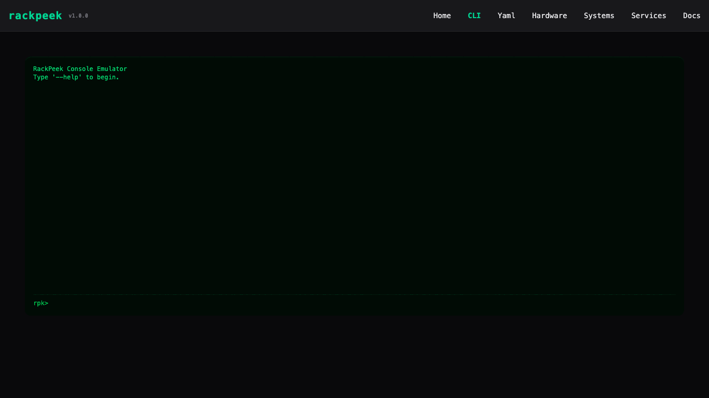

# RackPeek

RackPeek is a lightweight, opinionated CLI tool for documenting and managing home lab and small-scale IT infrastructure.

It helps you track hardware, services, networks, and their relationships in a clear, scriptable, and reusable way without enterprise bloat or proprietary lock-in.

RackPeek is open source and community-driven.
Code, docs, ideas, bug reports, and real-world usage feedback are all massively appreciated.
If you run a home lab, you belong here.

[](https://discord.gg/egXRPdesee)


## Philosophy
RackPeek treats infrastructure documentation as living reference data rather than static paperwork.

You should be able to document your environment as you build it, explore relationships between systems, and quickly understand how everything fits together, without drowning in unnecessary metadata or process.

RackPeek is not a CMDB replacement. It’s a clean framework for understanding and maintaining your lab.

[](./rpk-demo.gif)
[](./rpk-webui-demo.gif)

## Core Values

**Simplicity**  
RackPeek focuses on clarity and usefulness. Its scope is intentionally kept narrow to avoid unnecessary abstraction and feature creep.

**Ease of Deployment**  
The tool exists to reduce operational complexity. Installation, upgrades, and day-to-day usage should be straightforward and low-friction.

**Openness**  
RackPeek uses open, non-proprietary data formats. You fully own your data and should be free to easily inspect, migrate, or reuse it however you choose.

**Community**  
Contributors of all experience levels are welcome. Knowledge sharing, mentorship, and collaboration are core to the project’s culture.

**Privacy & Security**  
No telemetry, no ads, no tracking, and no artificial restrictions. What runs on your infrastructure stays on your infrastructure.

**Dogfooding**  
RackPeek is built to solve real problems we actively have. If a feature isn’t useful in practice, it doesn’t belong.

**Opinionated**  
The project is optimized for home labs and self-hosted environments, not enterprise CMDBs or corporate documentation workflows.

## Release Status
```
[x] Ideation
[~] Development
[ ] Alpha Release
[ ] Beta Release
[ ] v1.0.0 Release
```

## Command Tree
- [rpk](Commands.md#rpk)
  - [summary](Commands.md#rpk-summary) - Show a summarized report for all resources
  - [servers](Commands.md#rpk-servers) - Manage servers
    - [summary](Commands.md#rpk-servers-summary) - Show a summarized hardware report for all servers
    - [add](Commands.md#rpk-servers-add) - Add a new server
    - [get](Commands.md#rpk-servers-get) - List servers or get a server by name
    - [describe](Commands.md#rpk-servers-describe) - Show detailed information about a server
    - [set](Commands.md#rpk-servers-set) - Update server properties
    - [del](Commands.md#rpk-servers-del) - Delete a server
    - [tree](Commands.md#rpk-servers-tree) - Displays a dependency tree for the server
    - [cpu](Commands.md#rpk-servers-cpu) - Manage server CPUs
      - [add](Commands.md#rpk-servers-cpu-add) - Add a CPU to a server
      - [set](Commands.md#rpk-servers-cpu-set) - Update a CPU on a server
      - [del](Commands.md#rpk-servers-cpu-del) - Remove a CPU from a server
    - [drive](Commands.md#rpk-servers-drive) - Manage server drives
      - [add](Commands.md#rpk-servers-drive-add) - Add a drive to a server
      - [set](Commands.md#rpk-servers-drive-set) - Update a drive on a server
      - [del](Commands.md#rpk-servers-drive-del) - Remove a drive from a server
    - [gpu](Commands.md#rpk-servers-gpu) - Manage server GPUs
      - [add](Commands.md#rpk-servers-gpu-add) - Add a GPU to a server
      - [set](Commands.md#rpk-servers-gpu-set) - Update a GPU on a server
      - [del](Commands.md#rpk-servers-gpu-del) - Remove a GPU from a server
    - [nic](Commands.md#rpk-servers-nic) - Manage server NICs
      - [add](Commands.md#rpk-servers-nic-add) - Add a NIC to a server
      - [set](Commands.md#rpk-servers-nic-set) - Update a NIC on a server
      - [del](Commands.md#rpk-servers-nic-del) - Remove a NIC from a server
  - [switches](Commands.md#rpk-switches) - Manage switches
    - [summary](Commands.md#rpk-switches-summary) - Show switch hardware report
    - [add](Commands.md#rpk-switches-add) - Add a new switch
    - [list](Commands.md#rpk-switches-list) - List switches
    - [get](Commands.md#rpk-switches-get) - Get a switches by name
    - [describe](Commands.md#rpk-switches-describe) - Show detailed information about a switch
    - [set](Commands.md#rpk-switches-set) - Update switch properties
    - [del](Commands.md#rpk-switches-del) - Delete a switch
  - [systems](Commands.md#rpk-systems) - Manage systems
    - [summary](Commands.md#rpk-systems-summary) - Show system report
    - [add](Commands.md#rpk-systems-add) - Add a new system
    - [list](Commands.md#rpk-systems-list) - List systems
    - [get](Commands.md#rpk-systems-get) - Get a system by name
    - [describe](Commands.md#rpk-systems-describe) - Show detailed information about a system
    - [set](Commands.md#rpk-systems-set) - Update system properties
    - [del](Commands.md#rpk-systems-del) - Delete a system
    - [tree](Commands.md#rpk-systems-tree) - Displays a dependency tree for the system
  - [accesspoints](Commands.md#rpk-accesspoints) - Manage access points
    - [summary](Commands.md#rpk-accesspoints-summary) - Show access point hardware report
    - [add](Commands.md#rpk-accesspoints-add) - Add a new access point
    - [list](Commands.md#rpk-accesspoints-list) - List access points
    - [get](Commands.md#rpk-accesspoints-get) - Get an access point by name
    - [describe](Commands.md#rpk-accesspoints-describe) - Show detailed information about an access point
    - [set](Commands.md#rpk-accesspoints-set) - Update access point properties
    - [del](Commands.md#rpk-accesspoints-del) - Delete an access point
  - [ups](Commands.md#rpk-ups) - Manage UPS units
    - [summary](Commands.md#rpk-ups-summary) - Show UPS hardware report
    - [add](Commands.md#rpk-ups-add) - Add a new UPS
    - [list](Commands.md#rpk-ups-list) - List UPS units
    - [get](Commands.md#rpk-ups-get) - Get a UPS by name
    - [describe](Commands.md#rpk-ups-describe) - Show detailed information about a UPS
    - [set](Commands.md#rpk-ups-set) - Update UPS properties
    - [del](Commands.md#rpk-ups-del) - Delete a UPS
  - [desktops](Commands.md#rpk-desktops) - Manage Desktops
    - [add](Commands.md#rpk-desktops-add)
    - [list](Commands.md#rpk-desktops-list)
    - [get](Commands.md#rpk-desktops-get)
    - [describe](Commands.md#rpk-desktops-describe)
    - [set](Commands.md#rpk-desktops-set)
    - [del](Commands.md#rpk-desktops-del)
    - [summary](Commands.md#rpk-desktops-summary) - Show desktop hardware report
    - [tree](Commands.md#rpk-desktops-tree)
    - [cpu](Commands.md#rpk-desktops-cpu)
      - [add](Commands.md#rpk-desktops-cpu-add)
      - [set](Commands.md#rpk-desktops-cpu-set)
      - [del](Commands.md#rpk-desktops-cpu-del)
    - [drive](Commands.md#rpk-desktops-drive)
      - [add](Commands.md#rpk-desktops-drive-add)
      - [set](Commands.md#rpk-desktops-drive-set)
      - [del](Commands.md#rpk-desktops-drive-del)
    - [gpu](Commands.md#rpk-desktops-gpu)
      - [add](Commands.md#rpk-desktops-gpu-add)
      - [set](Commands.md#rpk-desktops-gpu-set)
      - [del](Commands.md#rpk-desktops-gpu-del)
    - [nic](Commands.md#rpk-desktops-nic)
      - [add](Commands.md#rpk-desktops-nic-add)
      - [set](Commands.md#rpk-desktops-nic-set)
      - [del](Commands.md#rpk-desktops-nic-del)
  - [services](Commands.md#rpk-services) - Manage services
    - [summary](Commands.md#rpk-services-summary) - Show service summary report
    - [add](Commands.md#rpk-services-add) - Add a new service
    - [list](Commands.md#rpk-services-list) - List all services
    - [get](Commands.md#rpk-services-get) - Get a service by name
    - [describe](Commands.md#rpk-services-describe) - Show detailed information about a service
    - [set](Commands.md#rpk-services-set) - Update service properties
    - [del](Commands.md#rpk-services-del) - Delete a service
    - [subnets](Commands.md#rpk-services-subnets) - List service subnets or filter by CIDR
